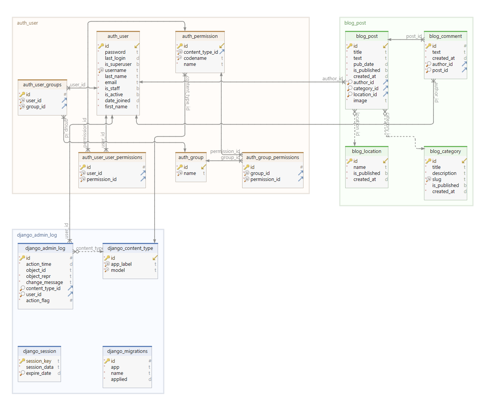

## Развёртывание проекта:
+ Клонировать репозиторий и перейти в него в командной строке:
```shell script
git clone git@github.com:Furturnax/django_sprint4.git
```

```shell script
cd django_sprint4/
```

+ Cоздать и активировать виртуальное окружение (Windows/Bash):
```shell script
python -m venv venv
```

```shell script
source venv/Scripts/activate
```

+ Установить зависимости из файла requirements.txt:
```shell script
python -m pip install --upgrade pip
```

```shell script
pip install -r requirements.txt
```

+ Перейти в директорию с manage.py:
```shell script
cd blogicum/
```

+ Выполнить миграции:
```shell script
python manage.py migrate
```

+ Загрузить фикстуры:
```shell script
python manage.py loaddata db.json
```

+ Запустить проект:
```shell script
python manage.py runserver
```

<br>

## Схема базы данных:


<br>

## Просмотр контента:
Перейти по адресу http://127.0.0.1:8000/.

<br>

## Доступ к панели администратора:
Зарегистрировать пользователя через Admin-панель.
+ Перейти в директорию с manage.py:
```shell script
cd blogicum/
```

+ Создать пользователя-администратора:
```shell script
python manage.py createsuperuser
```

+ Перейти по адресу http://127.0.0.1:8000/admin/ и ввести данные пользователя-администратора. Через панель администратора можно создавать публикации, категории, местоположение, группы пользователей и всем этим управлять в одном месте. 

<br>

## Тестирование проекта:
Тестирование реализовано с использованием библиотеки Pytest. 

+ Запустить тесты из основной директории проекта:
```shell script
pytest
```
